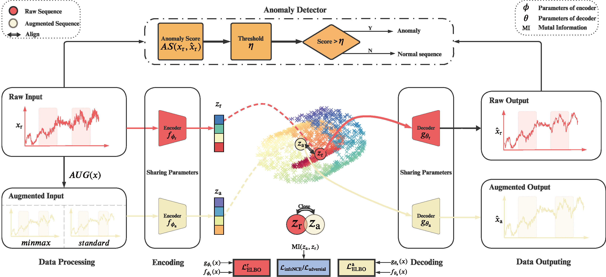

# Weakly Augmented Variational Autoencoder in Time Series Anomaly Detection



> ### Weakly Augmented Variational Autoencoder in Time Series Anomaly Detection
>
> Zhangkai Wu, Longbing Cao, Qi Zhang, Junxian Zhou, Hui Chen
>
> Paper: https://arxiv.org/abs/2401.03341

## Datasets

* [GD](https://www.kaggle.com/datasets/inIT-OWL/genesis-demonstrator-data-for-machine-learning)
* [HSS](https://www.kaggle.com/datasets/inIT-OWL/high-storage-system-data-for-energy-optimization)
* [ECG](https://www.cs.ucr.edu/~eamonn/time_series_data_2018/)
* [TD](https://www.cs.ucr.edu/~eamonn/time_series_data_2018/)

## Requirements

* Python 3.7

*  PyTorch 1.1

## Quick Start

1. infoNCE Loss
```shell
# GD
# contrast
python main.py --train --seed 3 --model_name VQRAEcontrast --log_name NCE --loss_function mse  --lmbda 0.0001 --use_clip_norm --batch_size 64 --preprocessing --dataset GD

# HSS
# contrast
python main.py --train --seed 3 --model_name VQRAEcontrast --log_name NCE --loss_function mse --lmbda 0.0001 --use_clip_norm --batch_size 64 --preprocessing --dataset HSS


# TD
## contrast
python main.py --train --seed 3 --model_name VQRAEcontrast --log_name NCE --loss_function mse --lmbda 0.0001 --use_clip_norm --batch_size 64 --preprocessing --dataset TD

```
2. AdversirialLoss

```shell
# GD
python main.py --train --seed 3 --model_name VQRAEcontrast --log_name Discriminator --loss_function mse  --lmbda 0.0001 --use_clip_norm --batch_size 64 --preprocessing --dataset GD --discriminator

# HSS
# discriminator
python main.py --train --seed 3 --model_name VQRAEcontrast --log_name Discriminator --loss_function mse  --lmbda 0.0001 --use_clip_norm --batch_size 64 --preprocessing --dataset HSS --discriminator


# ECG
# ECG contrast
python main.py --train --seed 3 --model_name VQRAEcontrast --log_name NCE --loss_function mse --lmbda 0.0001 --use_clip_norm --batch_size 64 --preprocessing --dataset ECG
# ECG discriminator

# TD
# discriminator
python main.py --train --seed 3 --model_name VQRAEcontrast --log_name Discriminator --loss_function mse  --lmbda 0.0001 --use_clip_norm --batch_size 64 --preprocessing --dataset TD --discriminator
```

## Citations
```
@article{wu2024weakly,
  title={Weakly Augmented Variational Autoencoder in Time Series Anomaly Detection},
  author={Wu, Zhangkai and Cao, Longbing and Zhang, Qi and Zhou, Junxian and Chen, Hui},
  journal={arXiv preprint arXiv:2401.03341},
  year={2024}
}
```
## Acknowlegments
Our codes are influenced by the following repos: [VLDB22]() and [CIKM20]()
